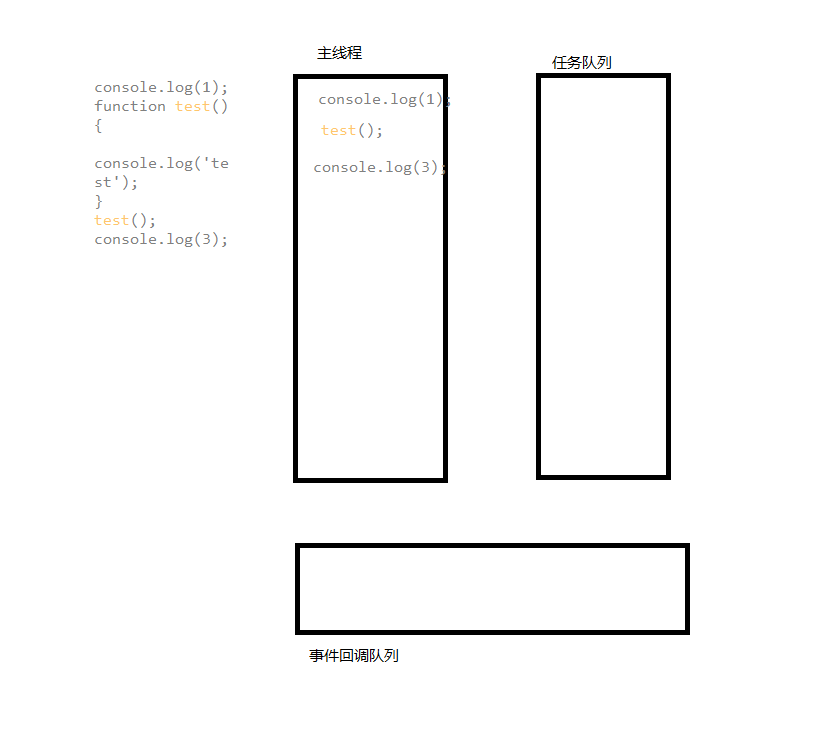
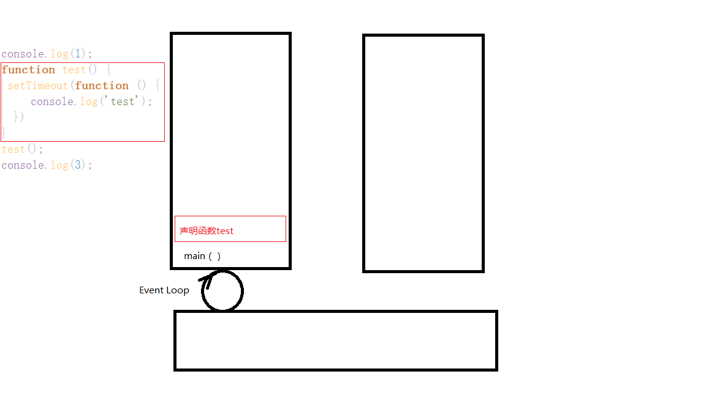

### JavaScript中的JS引擎的执行机制

  总所周知JavaScript语言是单线程语言，单线程就意味着所有的任务都是排队按序执行的，那到底是不是这样子呢？下面我们先看一段代码：
  ```javascript
      console.log(1);
      function test() {
        console.log('test');
      }
      test();
      console.log(3);
      //执行结果：1、test、3
  ```
  这样子看起来，按序执行的貌似是对的，但是真的是这样子吗？我们再来看下面这样一段代码：
  ```javascript
    
    console.log(1);
    function test() {
        setTimeout(function () {
            console.log('test');
        })
    }
    test();
    console.log(3);
    //执行结果：1、3、test

```
如果说所有的任务都是一样的排队执行，那上面的代码貌似输出结果也还是一样的——1、test、3，但是这里很不巧的是输出了——1、3、test，从这里的结果来看貌似和我们之前的假设已经不符合了，但是JavaScript语言是单线程这一点又是毋庸置疑的，那JavaScript里面的执行机制到底是怎么样的呢？下面就让我们一起来揭开JavaScript中执行机制的神秘面纱吧！
  
#### JavaScript当中的任务
  在JavaScript中，所有的任务广义上可以分为：
   * 同步任务（synchronous）
   * 异步任务（asynchronous）
   
   一、同步任务——就是在主线程上排队执行的任务，只有前一个执行完，才能执行下一个任务。
   
   二、异步任务——不进入主线程，而是进入任务队列"（task queue）的任务，task queue里面的任务只有当主线程上的任务执行完，主线程出现空闲的时候才会执行
   以下面的代码为例：
   ```javascript
     console.log(1);
     function test() {
       console.log('test');
     }
     test();
     console.log(3);
     //执行结果：1、test、3
```
   整个执行过程如图所示;
   
   
   以上的执行顺序就是将console.log(1);加入到主线程，主线程有任务存在机会将任务先执行完再继续往下走，于是会输出1，再往下继续，将声明test函数任务放入主线程，声明完成后继续往下走，再执行test函数，于是主线程中又增加了test函数的执行，在执行的过程中会将console.log('test')添加到主线程，于是会输出‘test’;test函数执行完成后，代码继续往下执行，将console.log(3)添加到主线程当中。于是主线程会输出3，所以，最后的输出结果是——1、test、3
   
   那么这段代码又会是怎么样的呢？
   ```javascript
    console.log(1);
    function test() {
      setTimeout(function () {
        console.log('test');
      })
    }
    test();
    console.log(3);
```
  整个执行过程如图所示：
   
   
   以上的执行顺序是 console.log(1)加入到主线程的执行任务当中去，主线程将执行 console.log(1);于是输出1；然后主线程就空闲继续下一个任务，此时声明函数test的任务将会加入到主线程，于是test将声明为一个方法，声明完成后主程序再次空闲，继续下一个任务；执行test，在执行test的时候

   
   