### JavaScript中的执行机制

 总所周知JavaScript语言是单线程语言，单线程就意味着所有的任务都需要按序执行，只有上一个任务结束后才能继续执行下一个任务，那JavaScript当中它的执行机制又是怎么样的呢？下面我们就将以代码为例，逐一的来理解。
 
#### JavaScript中的调用堆栈和任务队列
 为了更好的理解JavaScript中的调用堆栈和任务队列，请看下图（转引自Philip Roberts的演讲[《Help, I'm stuck in an event-loop》](http://vimeo.com/96425312)）：
 
   
   
  以上图说明主线程在执行的时候产生堆（heap）和栈（stack），当执行环境的堆栈中的一个任务（task）在执行的时候，其它的任务都要处于等待状态。当主进程执行到异步操作的时候就会将异步操作对应的task回调放置到对应的任务队列中，当主进程的调用堆栈中所有的task都执行完成后再去执行任务队列当中的task（回调函数）；如下：
 
 例子1：
  ```javascript
    console.log(1);
    function test() {
        setTimeout(function () {
            console.log('test');
        })
    }
    test();
    console.log(3);
    //执行结果：1、3、test
   ```
   以上代码的执行如下图所示：
   
   
   首先是在执行环境栈中压入执行上下文的main函数，再次是按照顺序执行将console.log(1);压入到执行环境栈中，于是执行环境栈中就有了一个task——console.log(1)，于是并开始执行该task，就输出了1，输出后代码开始继续往执行，得到下图所示环境：

   
   
   在执行环境栈中会加入一个什么test函数的task，于是会声明一个test函数，代码继续往下执行，图示如下：
   
   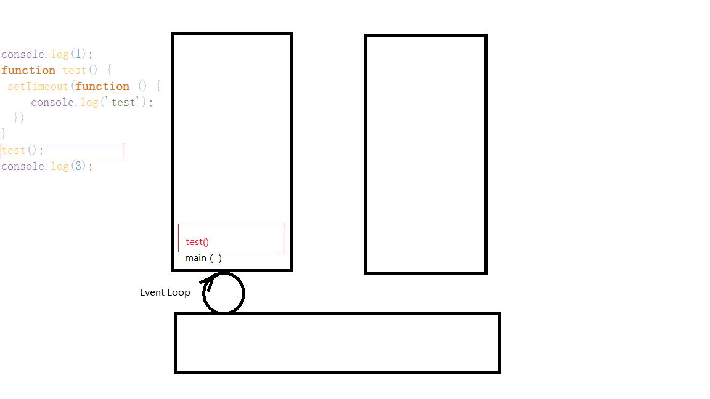
   在执行环境栈中会加入一个test()的task,于是会开始执行test(),在执行的时候执行机制如图：
   
   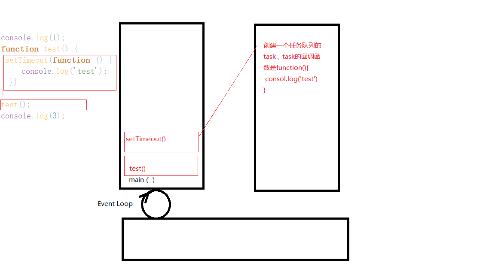
   test()在执行的时候会执行setTimeout,在执行setTimeout的时候就会创建一个任务队列的task，创建完该task后执行环境栈继续执行，如下图：
   
   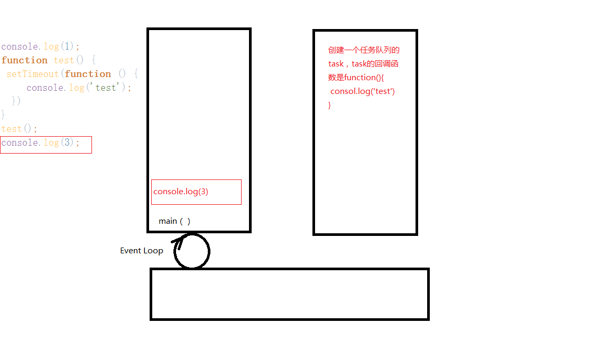
   
  在执行环境栈中会创建一个console.log(3)的task，并执行它，任务队列当中setTimeout创建的task处于等待状态，于是控制台会输出3，那么此时控制台的输出结果当中已经有了**1、3**两个数字，此时执行环境栈中的task已经都执行完成了，执行环境栈出现控制，那么这个时候就会去看任务队列里面的task是否有需要执行的，这个时候setTimeout创建的task就会被发现，该task的执行函数将会被添加到回调队列里面，因为执行环境栈中没有task，于是改回调函数将会被拿到执行环境栈中去执行，如下图所示：
  
  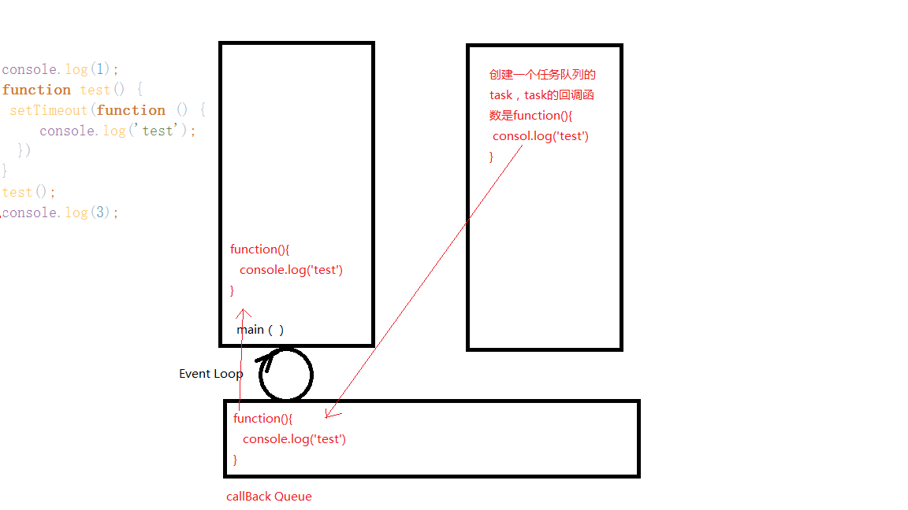
  
  这时候执行环境栈中的task会开始执行，于是会输出‘test’，输出完成后，执行环境栈、任务队列、回调队列都不存在task，于是整个过程执行完成。
  
#### 但是任务队列分为：macro-task(宏任务)、micro-task(微任务)。

 1. macro-task包括：script(整体代码), setTimeout, setInterval, setImmediate, I/O, UI rendering。
 2. micro-task包括：process.nextTick, Promises, Object.observe, MutationObserver
 
 事件循环的顺序是从script开始第一次循环，随后全局上下文进入函数调用栈，碰到macro-task就将其交给处理它的模块处理完之后将回调函数放进macro-task的队列之中，碰到micro-task也是将其回调函数放进micro-task的队列之中。直到函数调用栈清空只剩全局执行上下文，然后开始执行所有的micro-task。当所有可执行的micro-task执行完毕之后。循环再次执行macro-task中的一个任务队列，执行完之后再执行所有的micro-task，就这样一直循环。
 
 下面我将以process.nextTick，Promise,setImmediate、setTimeout为例；
 代码如下：
 ```javascript
    setTimeout(function () {
        console.log(1);
    },0);
    console.log(2);
    process.nextTick(() => {
        console.log(3);
    });
    new Promise(function (resolve, rejected) {
        console.log(4);
        resolve()
    }).then(res=>{
        console.log(5);
    })
    setImmediate(function () {
        console.log(6)
    })
    console.log('end');
```
 有了之前的执行分析，将上述代码划分为如图所示代码块：
 
 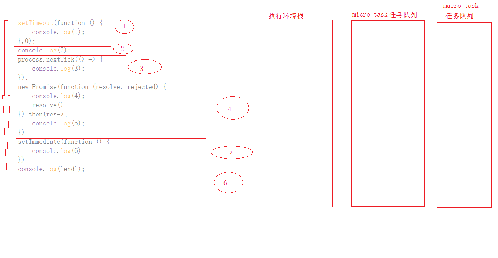
 代码开始按需执行，执行1—setTimeout的时候，将setTimeout的回调函数当成一个macro-task任务队列添加到macro-task任务队列里面，如图：
   
   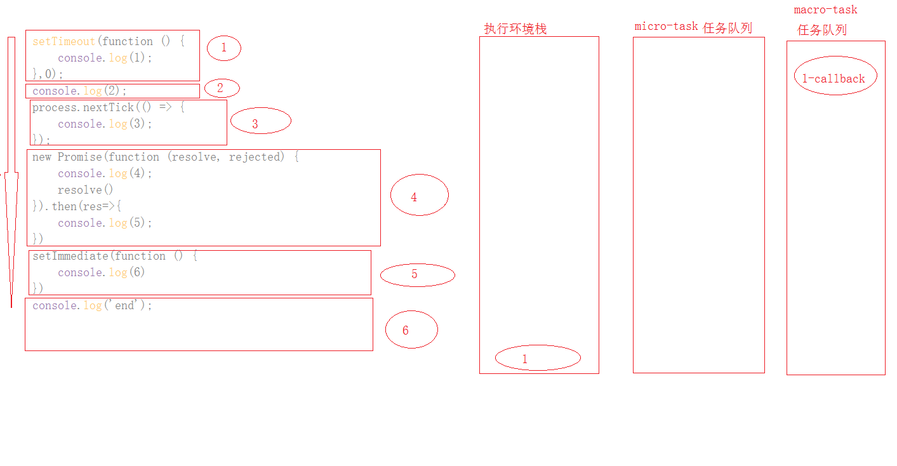
   
 继续执行下面代码2—console.log(2);于是控制台会输出2，如图：
 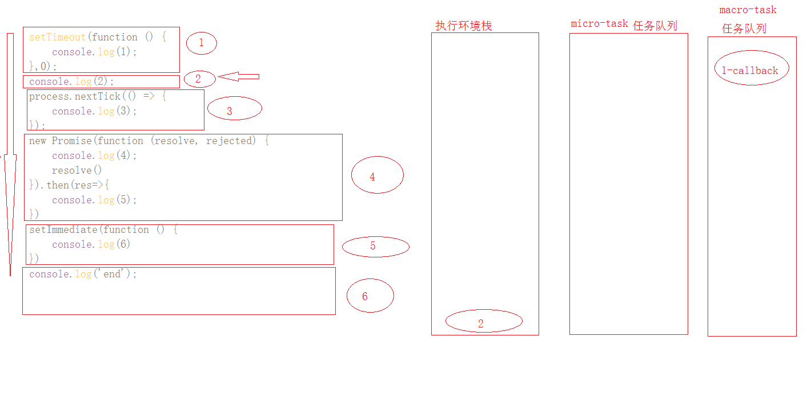
 
 紧接着开始执行3—process.nextTick，因为process.nextTick是micro-task任务，于是将该任务的回调函数加入到micro-task任务队列当中，形成下图：
 
 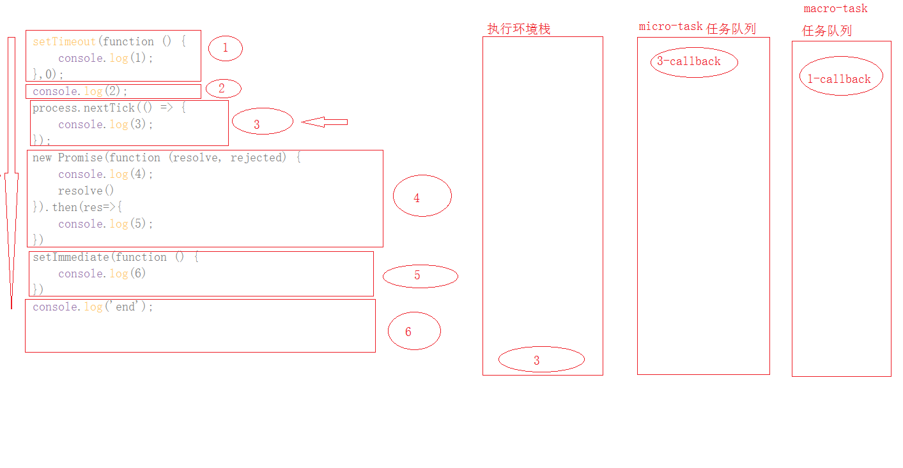
 
 控制台输出还是只有2，紧接着开始执行4-Promise,在执行new Promise的时候，创建Promise实例的时候，传入的函数将在执行环境栈中执行，于是会在控制台输出4，再讲回调函数then添加到micro-task任务队列当中，形成下图：
 
 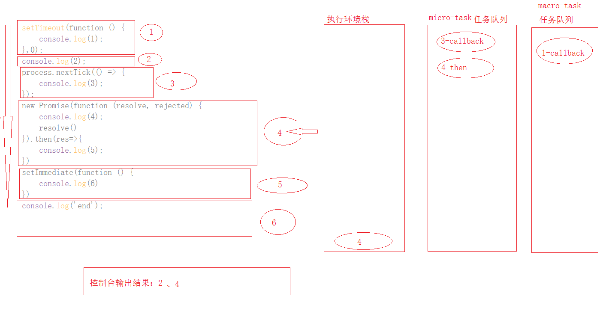
 
 紧接着开始执行5-setImmediate,于是会将5的回调函数添加到macro-task任务队列当中，形成下图：
 
  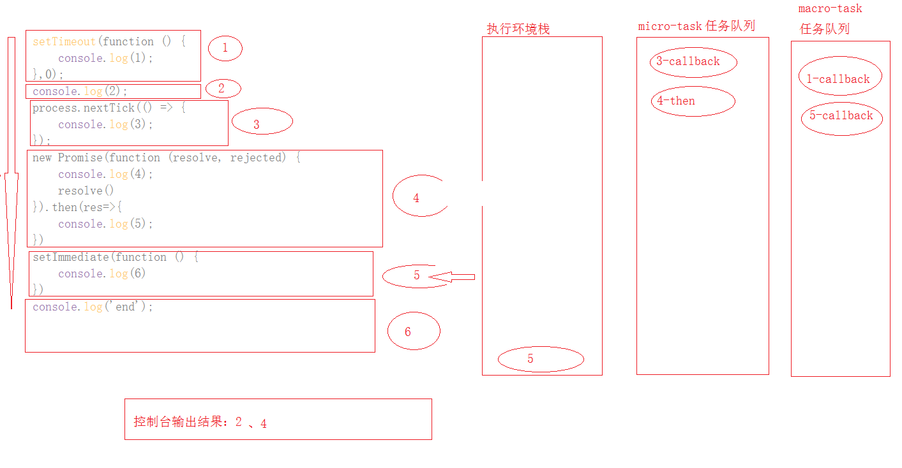
  
  继续执行6-console，于是执行环境栈中会增加一个console.log('end)的任务，于是控制台会输出6，形成下图：
    
   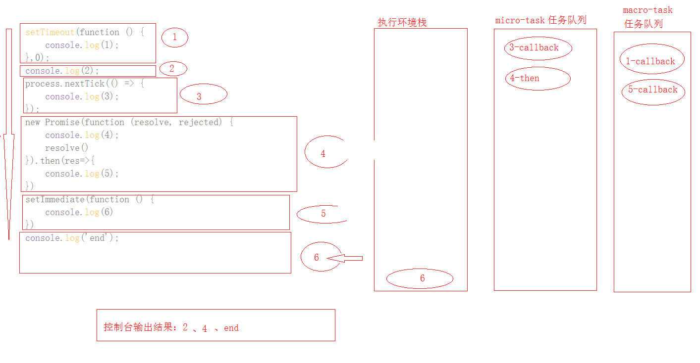
   
   执行到这里的时候，主线程的执行环境栈中已经没有任何任务了，那么这个时候Event Loop机制就会开始将micro-task任务队列当中满足执行条件的一个（3-callback）拿到执行环境栈中执行，形成如下图：
   
   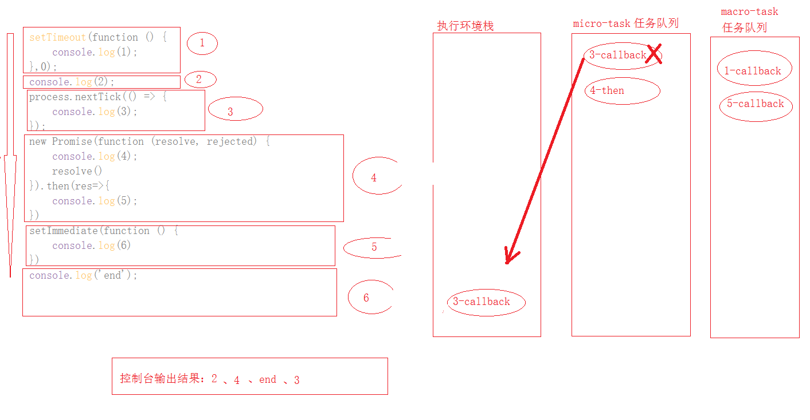
   
   那么控制台中将出现输出3，当该micro-task任务队列的任务执行完成后，同样的原理，再次将满足条件的（4-then）拿到执行环境栈中去执行，形成下图：
   
   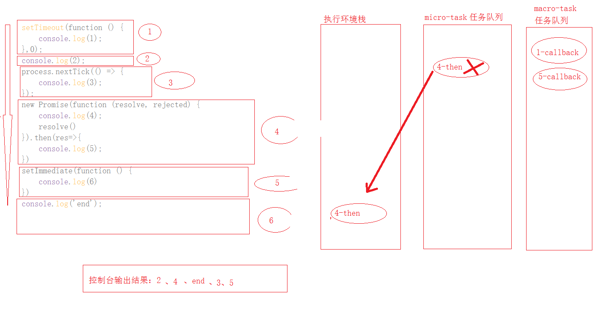
   
   这个时候micro-task任务队列里面的任务也执行完了，那么这个时候Event Loop机制将会到macro-task任务队列当中去将满足条件的任务拿到执行环境栈中去执行，与micro-task任务队列执行的时候是一样的原理，这里就不再画图了，先是将1-callback拿到执行环境中去执行，控制台会输出1，执行完成后再将5-callback拿到执行环境栈中去执行，控制台输出6；
   所以最后控制台的输出结果是：2、4、end、3、5、1、6；
  
 ### 总结：
  1. 主线程的执行环境栈上首先执行同步任务，然后再依靠Event Loop机制来不断循环将任务队列中的各个task放到执行环境栈中执行；
  
  2. 任务分为macro-task、micro-task，各有各的任务队列，即macro-task任务队列、micro-task任务队列；
  
  3. 总的执行顺序是 主线程上的task——micro-task——macro-task；
  
  参考资料：
  
  [JavaScript 运行机制详解：再谈Event Loop](http://www.ruanyifeng.com/blog/2014/10/event-loop.html)
  
  [深入浅出JavaScript事件循环机制(下)](https://zhuanlan.zhihu.com/p/26238030)
  
  [node中文网](http://nodejs.cn/api/)
  
 
 
 
 
 

   
   